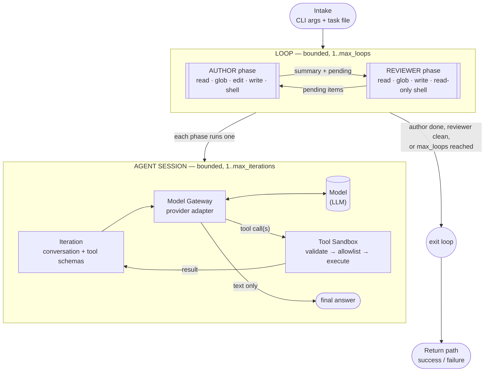

# Processing Pipeline

How a task flows through the system: **Loop → Agent Session → Model Gateway →
Model**, with a **Tool Sandbox** gating every tool call. Source locations are
in the legend at the end.

## Notes the diagram can't show

- The reviewer's job is to write a structured verdict (pending items +
  optional blocker), not free text. If that file comes back empty/unwritten,
  the loop treats the round as **inconclusive** and continues rather than
  failing.
- Persistence (run/loop state, per-phase metadata, event log) is written
  incrementally beside every stage, not after — a run stays
  inspectable/resumable even if the process dies mid-way.
- If the model returns no tool calls and no text twice in a row, the agent
  session ends as "stopped, not finished" rather than spinning.

## One invariant worth knowing

The per-iteration "workspace context" (iteration count, recent tool
results) is injected as its own block, never mixed into the fixed system
instructions — those must stay byte-identical across iterations for
provider-side prompt-cache reuse to work.

## Source-location legend

| Pipeline stage | Source |
|---|---|
| Intake | `src/main.rs`, `src/cli.rs`, `src/chat_template.rs`, `src/paths.rs` |
| Loop | `src/loop_runner.rs` (`PromptLoopRunner::run`) |
| Author / Reviewer phases | `src/loop_runner.rs` (`run_author_phase`, `run_review_phase`, `build_author_tools`/`build_review_tools`) |
| Agent session | `src/agent.rs` (`Agent::run`, `handle_tool_calls`) |
| Tool sandbox | `src/tools.rs` (`AgentTool` implementations, `validate_command`, `resolve_within_root`, `harden_command`) |
| Model gateway | `src/model/mod.rs` (interface), `src/model/anthropic.rs` (Anthropic adapter) |
| Persistence & observability | `src/logging.rs`, `src/telemetry.rs`, `src/observer.rs` |
| Return path | `src/main.rs`, `src/loop_runner.rs::run` |
